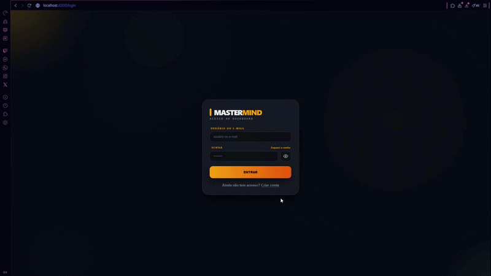
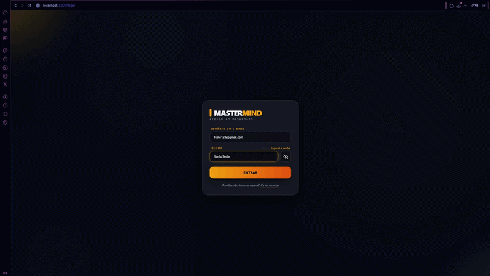
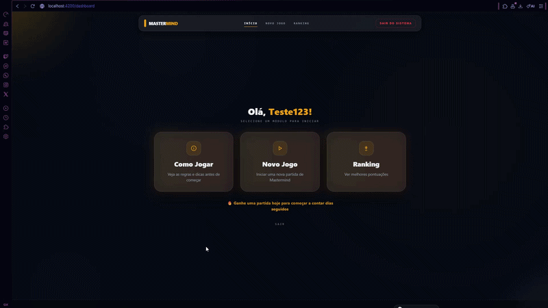
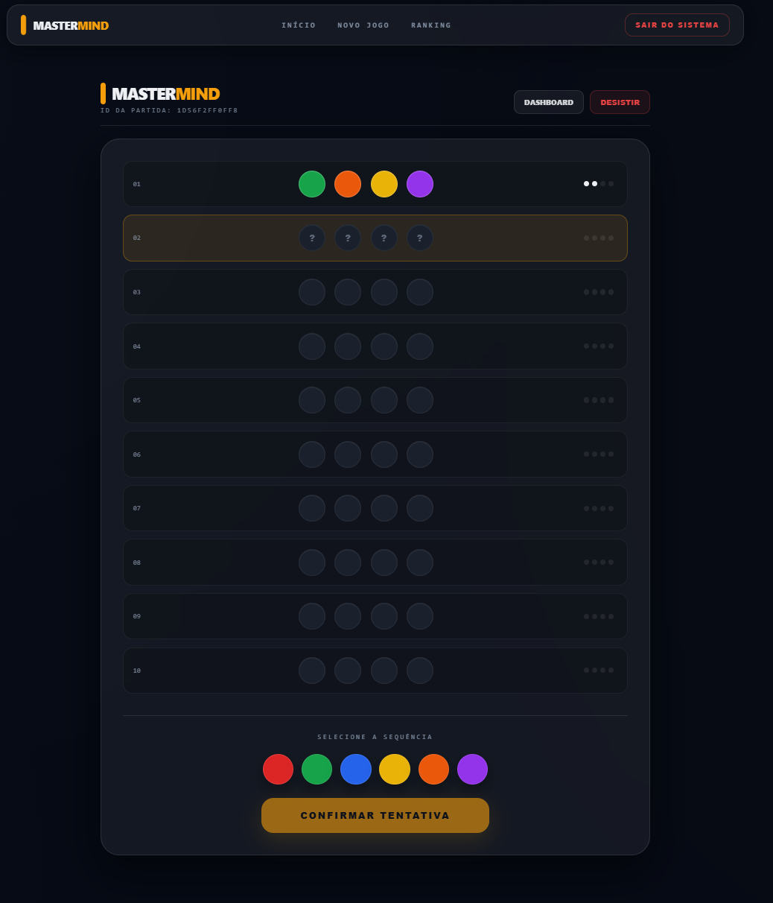
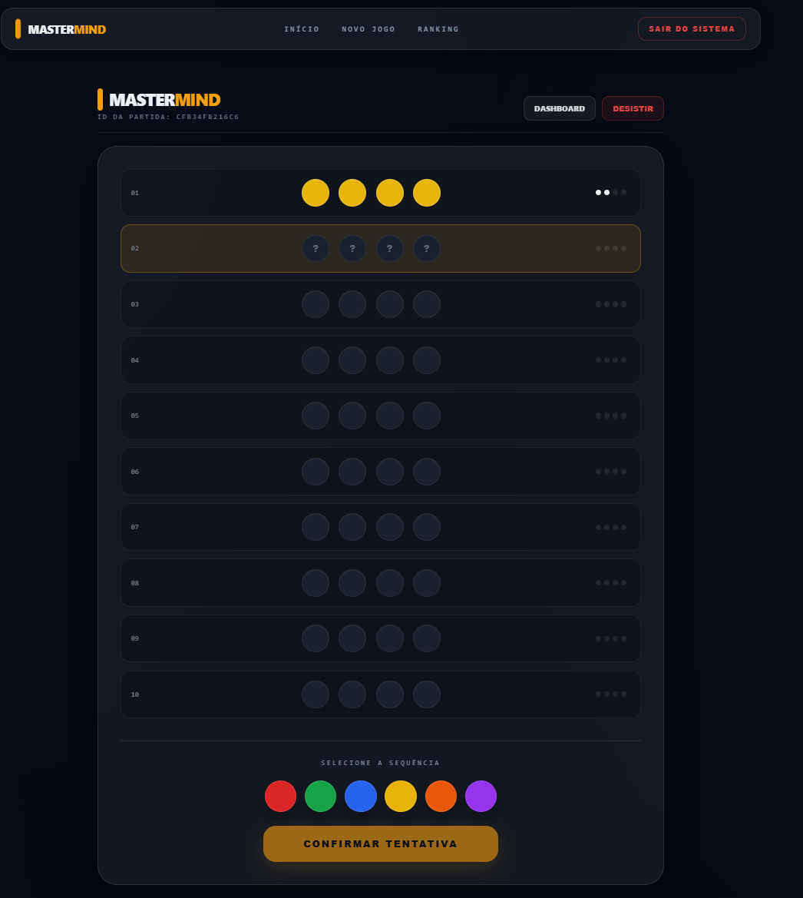
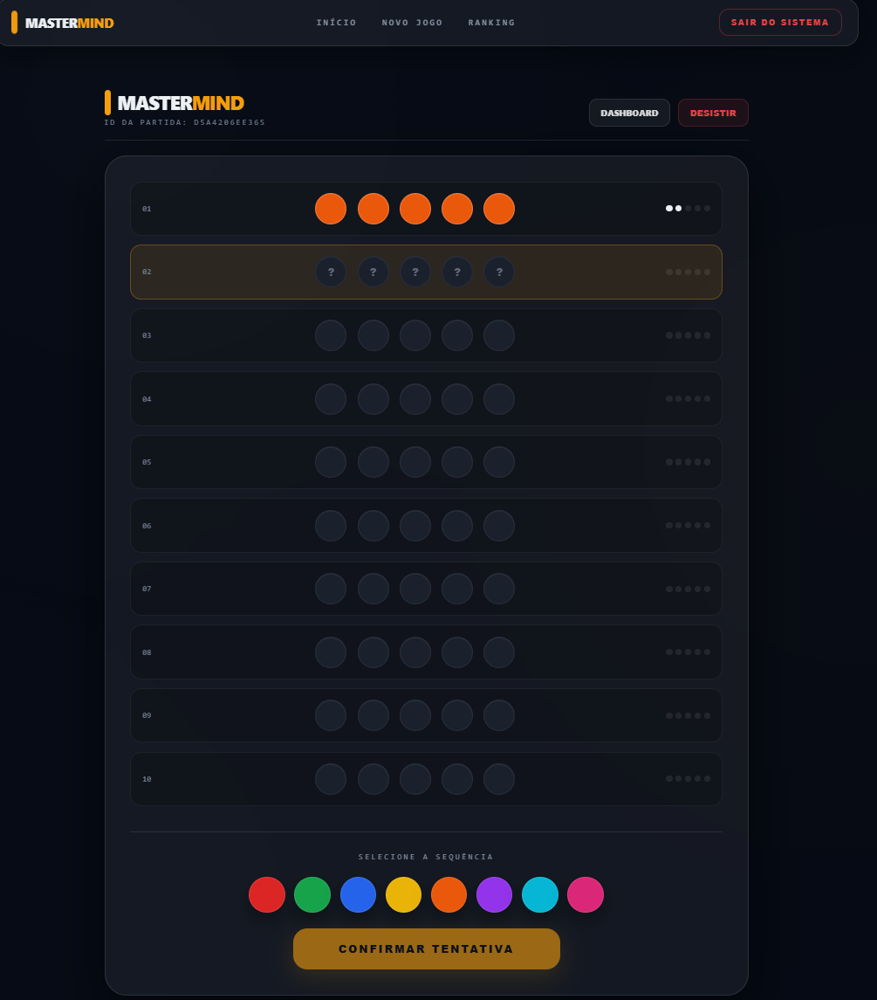
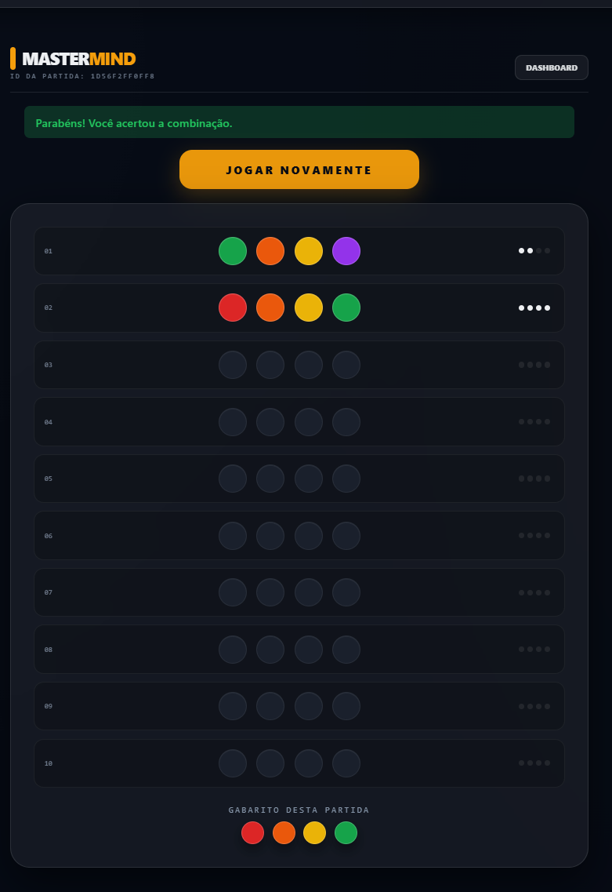
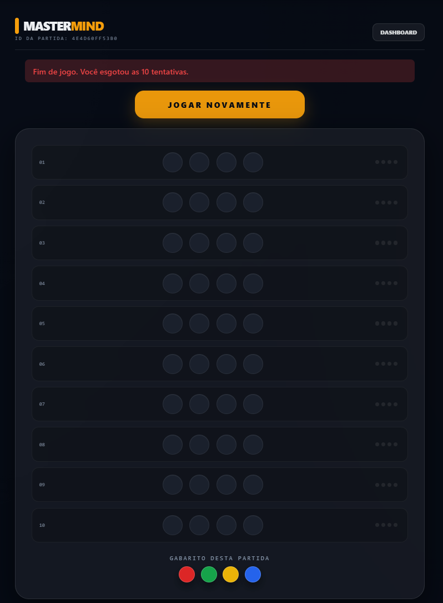
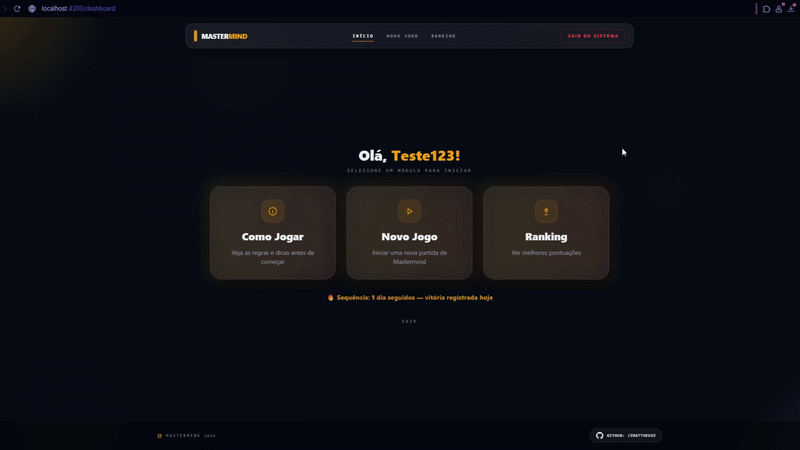
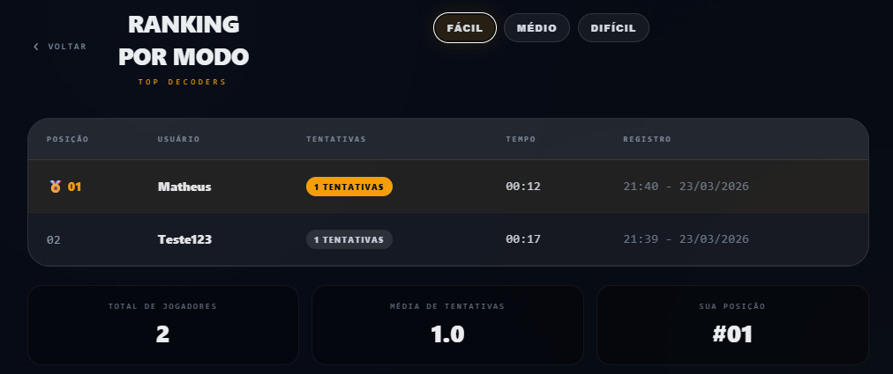

# Mastermind — Projeto Itaú

Jogo Mastermind no navegador: o jogador tenta adivinhar a sequência de cores; a API retorna **apenas quantas posições estão corretas** (cor e lugar). O código secreto só é exibido ao fim da partida.

**Stack:** Java 17, Spring Boot 3, Spring Security + JWT, JPA com H2 em arquivo, Angular 18 (componentes standalone), springdoc (Swagger). Testes: `mvn test` (backend) e `npm test` (frontend).

Estrutura: **`backend/`** (Maven) e **`frontend/`** (npm).

---

## Demonstração

### Cadastro e login

Cadastro com usuário, e-mail, senha e resposta à pergunta de segurança (usada na recuperação de senha). Após o cadastro, fluxo para a tela de login.



### Recuperação de senha

Recuperação de acesso via e-mail e resposta à pergunta de segurança.



### Tutorial

Após o login, tutorial com as regras e o tabuleiro; ao concluir, redirecionamento para iniciar o jogo.



### Dificuldades

Três níveis (tamanho da combinação e regras de repetição de cores), escolhidos antes da partida.

| Fácil | Médio | Difícil |
|:-----:|:-----:|:-------:|
|  |  |  |

### Fim de partida

Vitória: sequência revelada e opção de jogar novamente.



Derrota ou desistência: sequência revelada, mensagem de fim e opção de jogar novamente.



### Sequência diária (streak)

Contagem de dias consecutivos com vitória (qualquer dificuldade). Indicador visual antes e depois de completar o desafio no dia.

| Antes de vencer no dia | Após vencer |
|:----------------------:|:-----------:|
|  |  |

### Ranking

Ranking por dificuldade. Menos tentativas vem primeiro; em empate, vale o tempo da vitória (cronômetro durante a partida — ver atualização abaixo).



---

## Atualização — 24/03/2026 · Cronômetro

Há um **cronômetro** no topo da tela de jogo, ao lado do ID da partida. Conta o tempo enquanto a rodada está aberta e para quando acaba (vitória, derrota ou desistência), para ficar registrado quanto tempo durou aquela tentativa.


No **ranking** isso virou regra de desempate. Continua valendo quem usa **menos tentativas**; se duas pessoas empatarem nisso, quem resolveu **mais rápido** sobe. Por isso a tabela ganhou a coluna **Tempo** — é o registro da melhor vitória daquele jogador naquele modo (em minutos e segundos).



---

## Variáveis de ambiente

Referência em **`.env.example`** na raiz (sem valores reais).

| Configuração | Onde |
|--------------|------|
| `JWT_SECRET` | Variável de ambiente ou default em `backend/src/main/resources/application.yml` (somente desenvolvimento) |
| URL da API (Angular) | `frontend/src/environments/environment.ts` e `environment.prod.ts` |
| H2 | `backend/src/main/resources/application.yml` |

---

## Pré-requisitos

- JDK **17**, Maven **3.6+**
- Node **18+**, npm (Angular 18)

---

## Backend

```bash
cd backend
mvn spring-boot:run
```

- API: http://localhost:8080/api  
- Swagger: http://localhost:8080/api/swagger-ui.html  
- OpenAPI: http://localhost:8080/api/v3/api-docs  

Dados H2 em `backend/data/`. Em produção, usar `JWT_SECRET` forte (ver `.env.example`).

---

## Frontend

Backend em execução para autenticação e partidas.

```bash
cd frontend
npm install
npm start
```

http://localhost:4200 — CORS liberado para essa origem; outra porta exige ajuste em `SecurityConfig`. `apiUrl` em `frontend/src/environments/environment.ts`.

---

## Testes

```bash
cd backend && mvn test
cd frontend && npm test
```

---

## Banco (H2)

Console: http://localhost:8080/api/h2-console (com o backend ativo) — JDBC `jdbc:h2:file:./data/mastermind`; usuário e senha em `application.yml`.

---

## API

Documentação interativa: http://localhost:8080/api/swagger-ui.html (backend em execução).
